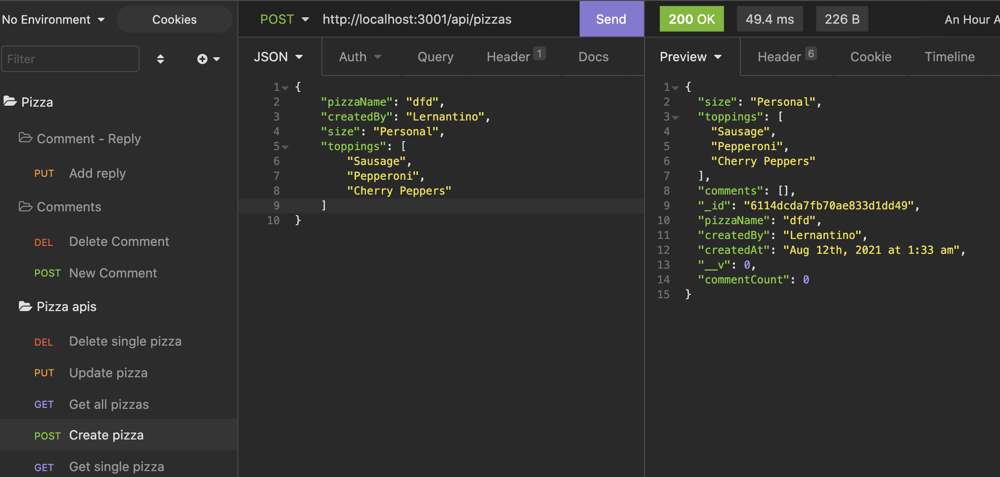

# pizza-hut

Creating the backend database for the Pizza ordering app using MongoDB.

## Post Route to create a pizza.



|                                         |                                         |                                                   |
| :-------------------------------------: | :-------------------------------------: | :-----------------------------------------------: |
|       [Introduction](#pizza-hut)        | [Table of Contents](#table-of-contents) | [Development Highlights](#development-highlights) |
|      [Installation](#installation)      |    [Page Directory](#page-directory)    |       [Code Hightlights](#code-highlights)        |
| [Technologies Used](#Technologies-Used) |           [Credits](#Credits)           |                [License](#License)                |

## Development Highlight

- Created models with Mongoose.

- Used viruals to extend the models' functionality.

- Created subschemas and subdocuments with Mongoose.

- Used IndexedDB to add offline functionality.

- Validated models to normalize data.

## Installation

1. Install node modules

```
npm i
```

2. Open MongoDB

```
mongodb
```

3. Start App

```
npm start
```

Makes request using Port 3001.

## Page Directory

### Controllers

The controller contains the methods we used for the routes.

### Models

The models includes the Comment and Pizza. An index.js is used to sotre the 2 models.

### Routes

There's an api routes and html routes. The api routes contain the methods found in the controller.

## Code Highlights

Add a subcollection of replies to the comments model. The function makes a requesti to find one comment and addes the reply bu pushing the value to the array.

```JavaScript
    addReply({ params, body }, res) {
        Comment.findOneAndUpdate(
            { _id: params.commentId },
            { $push: { replies: body } },
            {
                new: true,
                runValidators: true
            }
        )
            .then(dbPizzaData => {
                if (!dbPizzaData) {
                    return res.status(404).json({ message: 'No pizza found with this id.' })
                }
                res.json(dbPizzaData)
            })
            .catch(err => res.json(err));
    },
```

Creating the CommentSchema. Validators are used and replies and updated through an array.

```JavaScript
const CommentSchema = new Schema(
    {
        writtenBy: {
            type: String,
            required: true,
            trim: true
        },
        commentBody: {
            type: String,
            required: true,
            trim: true
        },
        createdAt: {
            type: Date,
            default: Date.now
        },
        replies: [ReplySchema]
    },
    {
        toJSON: {
            virtuals: true,
            getters: true
        },
        id: false
    }
);
```

## Technologies

### Backend Language

- [Node.js](https://nodejs.org/en/)

### Backend Framework

- [Express.js](https://expressjs.com/)

### Database

- [MongoDB](https://www.mongodb.com/)

## Credits

|                           |                                                                                                                                                                                                       |
| ------------------------- | ----------------------------------------------------------------------------------------------------------------------------------------------------------------------------------------------------- |
| **David Anusontarangkul** | [ LinkedIn](https://www.linkedin.com/in/anusontarangkul/) [ GitHub](https://github.com/anusontarangkul) |

## License

[](https://opensource.org/licenses/MIT)
